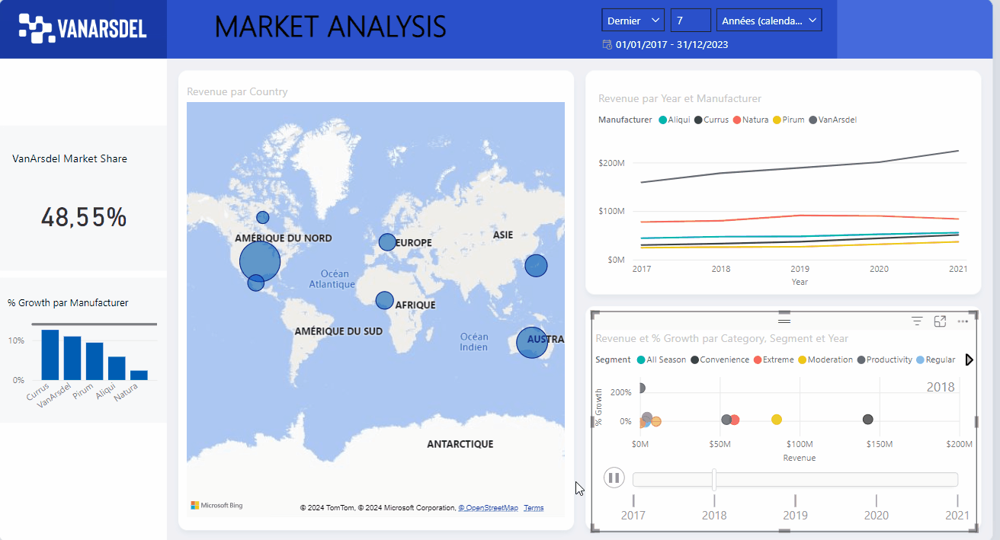
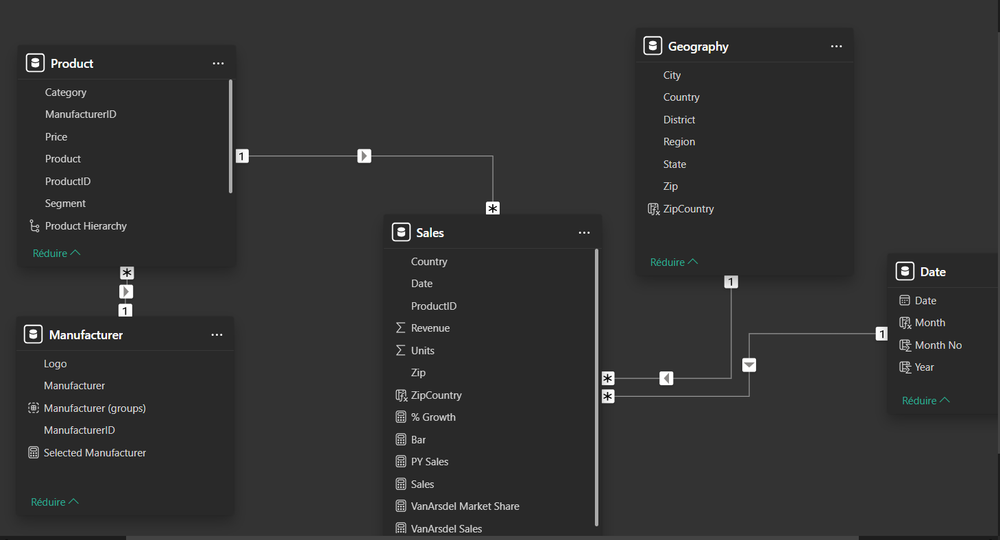
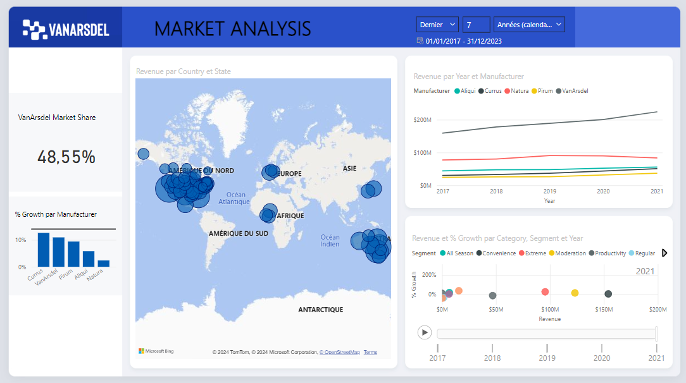
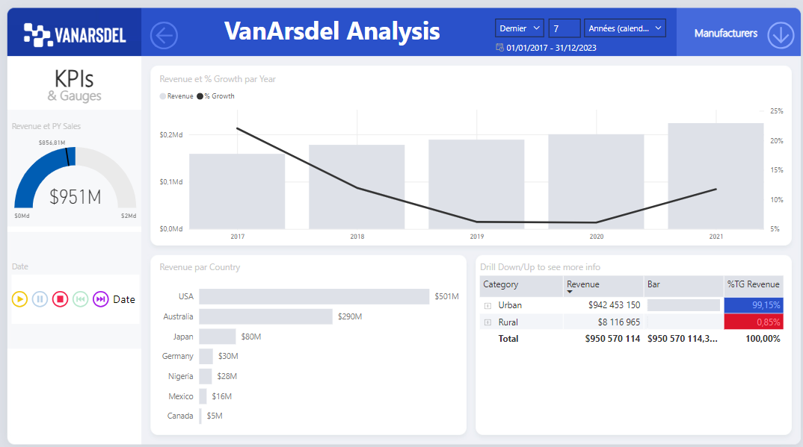

# PowerBI_Data_Analysis
Rapport Power BI - Analyse des Parts de Marché de Van Arsdel




## Description du Projet
Ce repository présente un **rapport Power BI** qui met en évidence les parts de marché de l'entreprise **Van Arsdel** à l'échelle mondiale, en comparaison avec ses principaux concurrents. Le rapport offre des visualisations interactives et des analyses chiffrées pour mieux comprendre la performance de l'entreprise.

## Objectifs de l'Analyse
- **Visualiser les parts de marché** : Comparer les performances de Van Arsdel avec ses concurrents.
- **Explorer la croissance** : Identifier les régions et périodes de croissance.
- **Fournir des KPIs clés** : Calculer et afficher les mesures les plus pertinentes pour l'entreprise.

## Fonctionnalités Principales
1. **Modélisation des Données**
   - Normalisation des données avec la **création d'une table Date** pour la gestion des axes temporels.
   - Structuration des relations entre les tables pour garantir l'intégrité des données.
   - Ajout de colonnes calculées et de mesures via **DAX** pour les besoins analytiques.
     - Exemple de mesure :
       - **% Growth** : 
         ```
         % Growth = DIVIDE(SUM(Sales[Revenue]) - [PY Sales], [PY Sales])
         ```
         Cette mesure permet de calculer la croissance en pourcentage des revenus par rapport à l'année précédente.
       - **VanArsdel Sales** :
         ```
         VanArsdel Sales = CALCULATE(SUM(Sales[Revenue]), Manufacturer[ManufacturerID] = 7)
         ```
         Cette mesure extrait les ventes spécifiques de Van Arsdel pour faciliter la comparaison avec les concurrents.

2. **Visualisations Interactives**
   - **Page Principale** : Aperçu global des parts de marché et des KPIs clés.
   - **Analyse de Marché (Page 2)** :
     - Visualisation des parts de marché par concurrents.
     - Décomposition par région, période, et fabricant.
   - **Filtres et Slicers** : Possibilité de naviguer dans les données en filtrant par fabricant, région ou période.

3. **Schema de Données**
   

## Aperçu des Pages du Rapport
1. **Page Principale** :
   - Détail des parts de marché pour Van Ardsel face à ses concurrents principaux.
   - Graphiques interactifs pour comparer les revenus par fabricant.

   


 2. **Page Details de Van Ardsel** :
   - Visualisation globale des parts de marché et des KPIs principaux.
   - Exemple de KPI : **Croissance des ventes (%)** et **Ventes totales**.

   


## Détails Techniques
- **Power Query** : Normalisation et transformation des données.
- **DAX** : Calcul de mesures personnalisées et création de colonnes calculées.
- **Modélisation des données** : Structuration des tables Date, Sales, et Manufacturer.

## Prérequis
- Installer **Power BI Desktop** : [Lien de téléchargement](https://powerbi.microsoft.com/fr-fr/downloads/)
- Télécharger le rapport Power BI ici :  
   [VanArdsel_MarketReport.pbix](https://we.tl/t-WeGTJ80I0q)
- Ouvrir le fichier **Market_analysis_report.pbix** dans Power BI Desktop.

## Conclusion
Ce rapport met en évidence les performances de Van Ardsel dans un contexte concurrentiel global. Les visualisations interactives et les mesures calculées permettent d'obtenir des insights stratégiques sur les parts de marché et la croissance des ventes.

---

## Auteur
**Alexandra Jane Bitom**  
[LinkedIn](https://www.linkedin.com/in/alexandra-jane-bitom) | [Email](mailto:alexandra.jane@example.com)

---
**Date de création** : 2023  
**Dernière mise à jour** : 2024

---
© 2024 Alexandra Jane Bitom. Tous droits réservés.
